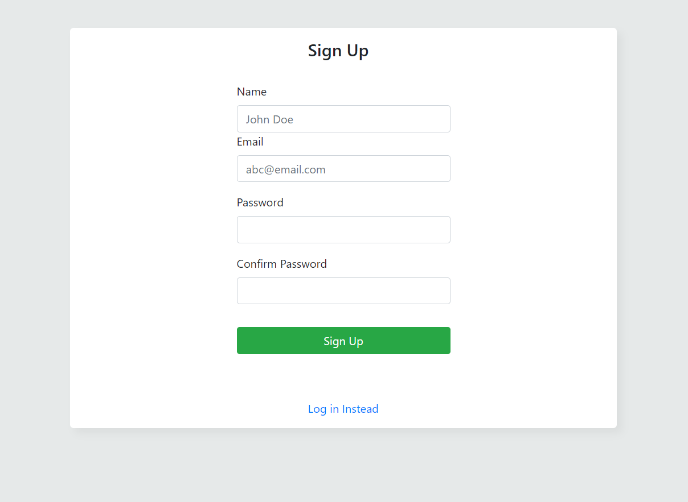
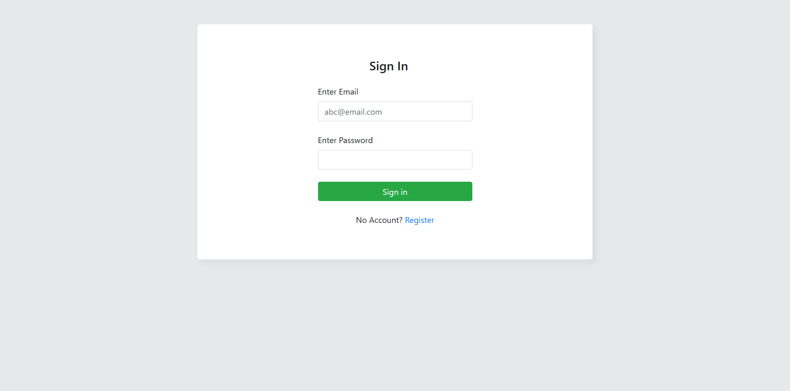
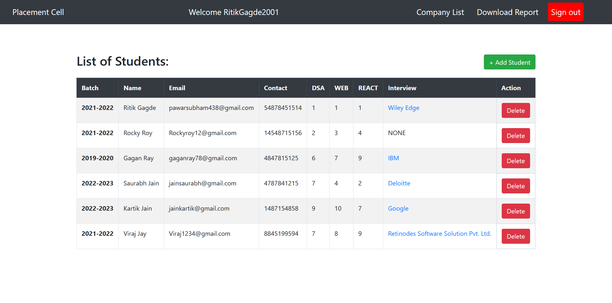
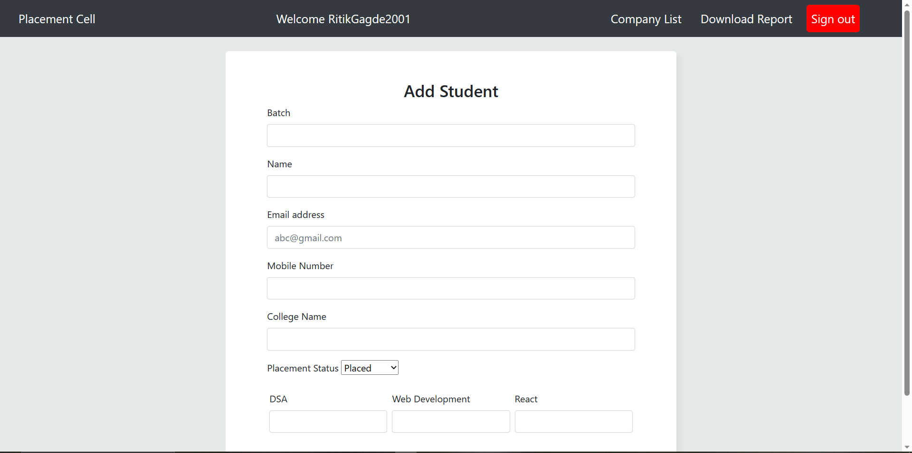

# NodeJS-Placement-Cell
 <h1 align="center">Placement Cell  📝</h1> 

 🖊️ An interface for coding ninjas placement cell to keep records of students and schedule interviews with different companies  
     This App built using <a href="https://ejs.co/">EJS</a>, <a href="https://www.mongodb.com/">MongoDB</a>, <a href="https://expressjs.com/">ExpressJs</a>, <a href="https://nodejs.org/en/">NodeJs</a> and <a href="http://www.passportjs.org/">PassportJS</a>

## Features

- Sign up / Sign in forms for employees
- Add a new student to the list of students
- Allocate and schedule interview with different companies and update their result status
- Download reports of students in csv format

## Screenshots

- Sign Up
  

- Sign In
  

- Student Page
  

- Interview Page
  

- Add student
  

- Schedule Interview
  

## Setup

Run `npm install` to install required dependencies

Environment Variables:

- PORT = [Your Port]
- SECRET = [Your Secret]
- MONGO_URI = [Your MongoDB Ur]
